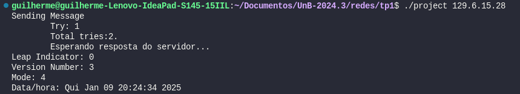

<style>body {text-align: justify}</style>

> Integrantes do Grupo: 
>
> Guilherme Brito Vilas Boas (190108011)

> Sistema Utilizado: Linux Ubuntu 22.04
> 
> Ambiente de Desenvolvimento: Visual Studio Code

---

# Build

Para a build desse projeto, é necessário rodar o comando `make project` para que o arquivo executável seja gerado.

---

# Execução do Programa

Para a execução do programa, basta após a **build**, executar o comando `./project <IP SERVIDOR SNTP>`.

> exemplo: `./project 129.6.15.28`

> 

---

# Introdução

Este trabalho tem como objetivo a criação de um cliente para o protocolo SNTP.

O SNTP (Simple Network Time Protocol) é um protocolo derivado do NTP (Network Time Protocol), especificado pela [RFC-1305](https://www.ntp.org/reflib/rfc/rfc1305/rfc1305b.pdf). Ambos os protocolos são utilizados para manter os relógios dos dispositivos sincronizados.

## Componentes

Para a realização deste trabalho, foi necessário o desenvolvimento de componentes adicionais, como, por exemplo um `Cliente Genérico UDP`.

## Cliente Básico UDP 

Neste tópico, será apresentada a descrição da pequena biblioteca de um cliente UDP genérico desenvolvida pelo grupo para enviar mensagens via protocolo UDP para um servidor. 

A função **principal** send_message é responsável por enviar uma mensagem via protocolo UDP para o servidor especificado, além de gerenciar a espera pela resposta. Ela pode ser configurada com diferentes parâmetros para ajustar o comportamento do envio e da espera pela resposta, como número de tentativas e tempo de espera.

```c
void *send_message(const char *peer_ip, int peer_port, void *payload, struct send_message_flags flags);
```

Essa função recebe por parâmetro o ip e porta de envio do pacote UDP (**peer_ip** e **peer_port**), o pacote que será enviado (**payload**) e um parâmetro adicional de algumas flags possíveis para configuração do comportamento da função:

```c
struct send_message_flags {
    int retries; # Define o número de tentativas que o cliente deve realizar caso o envio da mensagem ou o recebimento da resposta falhe. O valor padrão é 2 (1 + 1 tentativa), conforme especificado no relatório do Trabalho.
    bool wait_for_answer; # Indica se o cliente deve aguardar uma resposta após enviar o pacote UDP. Para o cenário deste trabalho, este valor deve ser configurado como true, uma vez que o cliente SNTP espera receber uma resposta do servidor contendo informações sobre o tempo.
    int timeout; # Define o tempo máximo (em segundos) que o cliente deve aguardar pela resposta do servidor antes de abortar a operação. O valor padrão é configurado para 20 segundos, conforme especificado no relatório do Trabalho.
};
```

---

#### Retorno

A função retorna um ponteiro void*, que pode ser utilizado para acessar a resposta do servidor (se `wait_for_answer` for true). Caso não haja resposta ou o tempo de espera seja excedido, a função pode retornar NULL ou um valor indicativo de falha, dependendo da implementação interna.

---

#### Lógica de Funcionamento


### 1. **Configuração do Endereço de Destino**

- O endereço IP e a porta do servidor de destino são configurados na estrutura [`sockaddr_in`](https://www.gta.ufrj.br/ensino/eel878/sockets/sockaddr_inman.html).
  - O IP é convertido de formato string para binário usando a função [`inet_aton()`](https://www.gta.ufrj.br/ensino/eel878/sockets/inet_ntoaman.html).
  - A porta de destino é configurada com a função [`htons()`](https://www.gta.ufrj.br/ensino/eel878/sockets/htonsman.html) para garantir que o valor seja interpretado corretamente pelo protocolo de rede.
- Caso o IP fornecido seja inválido, a função exibe uma mensagem de erro e retorna `NULL`.

```c
struct sockaddr_in peer_addr = {.sin_family = AF_INET, .sin_port = htons(peer_port)};

if (inet_aton(peer_ip, &peer_addr.sin_addr) <= 0) {
    perror("Invalid IP address.");
    return NULL;
}

int udp_socket = socket(AF_INET, SOCK_DGRAM, 0);
```

### 2. **Criação do Socket UDP**
- A função segue tentando criar um socket UDP com a chamada à função [`socket()`](https://man7.org/linux/man-pages/man2/socket.2.html). 
- Se a criação do socket falhar, uma mensagem de erro é exibida, e a função retorna `NULL`.

```c
int udp_socket = socket(AF_INET, SOCK_DGRAM, 0);
if (udp_socket < 0) {
    perror("Socket creation failure.");
    return NULL;
}
```

### 3. **Envio da Mensagem**
- O código tenta enviar o pacote de dados (payload) para o servidor utilizando a função [`sendto()`](https://pubs.opengroup.org/onlinepubs/009604499/functions/sendto.html).
  - Caso o envio falhe, o socket é fechado e a função retorna `NULL`.

```c
  if (sendto(udp_socket, payload, sizeof(struct ntp_packet), 0, (struct sockaddr *)&peer_addr, sizeof(peer_addr)) < 0) {
            perror("Sending message failure.");
            close_socket(udp_socket);
            return NULL;
        }
```

### 4. **Aguarda Resposta**
- Se a flag `wait_for_answer` for configurada como `true`, a função aguarda a resposta do servidor.
  - A função utiliza a chamada [`select()`](https://man7.org/linux/man-pages/man2/select.2.html) para aguardar por uma resposta dentro do período de tempo configurado na flag `timeout`.
  - A função verifica se o servidor respondeu dentro do tempo limite.
  - Caso o tempo expire sem resposta, o código tenta reenviar a mensagem até atingir o número máximo de tentativas configurado.
  - Se `select()` retornar um erro, o socket é fechado e a função retorna `NULL`.

```c
int try = 1;
    int total_tries = flags.retries + 1;
    do {
        flags.received_message = false;
        printf("Sending Message\n\tTry: %d\n\tTotal tries:%d.\n", try, total_tries);

        if (sendto(udp_socket, payload, sizeof(struct ntp_packet), 0, (struct sockaddr *)&peer_addr, sizeof(peer_addr)) < 0) {
            perror("Sending message failure.");
            close_socket(udp_socket);
            return NULL;
        }

        if (flags.wait_for_answer) {
            int ret;
            fd_set readfds;
            struct timeval timeout;
            timeout.tv_sec = flags.timeout;
            timeout.tv_usec = 0;

            FD_ZERO(&readfds);
            FD_SET(udp_socket, &readfds);

            printf("\tEsperando resposta do servidor...\n");
            ret = select(udp_socket + 1, &readfds, NULL, NULL, &timeout);

            if (ret < 0) {
                perror("Error during select.");
                close_socket(udp_socket);
                return NULL;
            } else if (ret == 0) {
                printf("\tOtempo expirou e não houve reposta do servidor.\n");
                try++;
            } else {
                flags.received_message = true;
            }
        }
    } while (try <= total_tries && !flags.received_message);
```

### 5. **Recebimento da Resposta**
- Quando uma resposta do servidor é recebida, o código a processa com a função [`recvfrom()`](https://www.gta.ufrj.br/ensino/eel878/sockets/recvman.html).
  - O tamanho dos dados recebidos é comparado com o tamanho esperado de um pacote SNTP.
  - Se a quantidade de dados recebidos for menor do que o esperado, um erro é gerado e o socket é fechado.

```c
 if (flags.received_message) {
        socklen_t addr_len = sizeof(peer_addr);
        ssize_t received_bytes = recvfrom(udp_socket, payload, sizeof(struct ntp_packet), 0, (struct sockaddr *)&peer_addr, &addr_len);

      if (received_bytes < 0) {
          perror("Error receiving message.");
          close_socket(udp_socket);
          return NULL;
      } else if (received_bytes < (ssize_t)sizeof(struct ntp_packet)) {
          fprintf(stderr, "Incomplete SNTP packet received (%zd bytes).\n", received_bytes);
          close_socket(udp_socket);
          return NULL;
      }
  }
```

### 6. **Fechamento do Socket**
- Após o envio ou recebimento da mensagem, o socket é fechado com a função `close_socket()`.
  - A função [`close_socket()`](https://man7.org/linux/man-pages/man2/close.2.html) garante que o socket seja fechado corretamente, liberando os recursos do sistema.

```c
int close_socket(int socket)
{
    if (close(socket) < 0)
    {
        perror("Error closing socket.");
        return EXIT_FAILURE;
    }

    return EXIT_SUCCESS;
}
```

---

### Exemplo de Uso

```c
struct send_message_flags flags = {.wait_for_answer = true, .timeout = 20, .retries = 1};
struct ntp_packet ntp_packet;

memset(&ntp_packet, 0, sizeof(ntp_packet));
ntp_packet.li_vn_mode = 0x1B;

struct ntp_packet *response = (struct ntp_packet *)send_message(server_ip, 123, (void *)&ntp_packet, flags);

```
